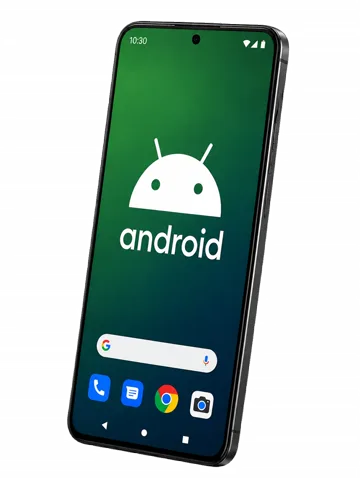
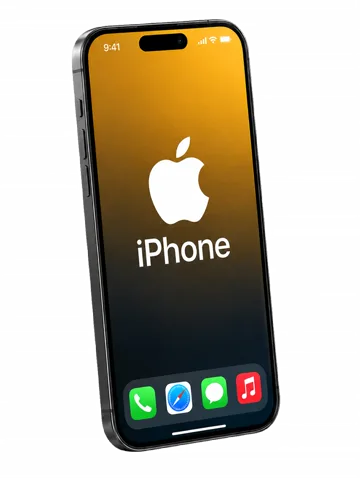

<table>
  <tr>
    <td width="28%" align="center" valign="middle">
      <a href="https://autonomiadigital50mais.com.br/">
        
      </a>
    </td>
    <td width="47%" valign="middle">
      <h1>Autonomia Digital 50+</h1>
      <h3>Liberdade digital, no seu ritmo.</h3>
      <p>Educação tecnológica clara, segura e acolhedora para pessoas 50+.</p>
      <p><a href="https://autonomiadigital50mais.com.br/"><strong>［ CONHECER O PROJETO ］</strong></a></p>
    </td>
    <td width="25%" align="center" valign="middle">
      
    </td>
  </tr>
</table>

## O projeto

O **Autonomia Digital 50+** transforma tarefas digitais cotidianas em aprendizado acessível. A experiência foi desenhada para reduzir insegurança, respeitar ritmos diferentes e oferecer continuidade por meio de aulas e comunidade de apoio.

| Aprender | Praticar | Proteger | Continuar |
|:--|:--|:--|:--|
| Android e iPhone | Tarefas da vida real | Segurança digital | Comunidade de apoio |
| Linguagem direta | Passos demonstráveis | Decisões conscientes | Aprendizado no próprio ritmo |

## Experiência

<table>
  <tr>
    <td width="50%" align="center">
      <br>
      <strong>Android</strong><br>
      <sub>Fundamentos, comunicação, câmera, aplicativos e segurança.</sub>
    </td>
    <td width="50%" align="center">
      <br>
      <strong>iPhone</strong><br>
      <sub>Configuração, recursos essenciais, organização e autonomia.</sub>
    </td>
  </tr>
</table>

## Princípios de produto

- **Clareza antes de velocidade:** cada etapa precisa ser compreensível.
- **Autonomia antes de dependência:** ensinar o raciocínio, não apenas o clique.
- **Segurança por padrão:** riscos digitais aparecem no contexto da tarefa.
- **Acessibilidade real:** tipografia legível, controles amplos e linguagem direta.
- **Acolhimento sem infantilização:** respeito à experiência de quem aprende.

## Arquitetura pública

```text
Autonomia Digital 50+
├── experiência pública          conteúdo e apresentação
├── trilhas de aprendizagem      Android · iPhone · segurança
├── comunidade                   apoio e continuidade
└── plataforma privada           acesso · progresso · administração
```

Este é o repositório público de apresentação do projeto. O código operacional da plataforma, integrações de pagamento, dados de alunos e ferramentas administrativas permanecem privados por segurança.

## Links

- [Site oficial](https://autonomiadigital50mais.com.br/)
- [Instagram](https://www.instagram.com/autonomiadigital50mais/)
- [YouTube](https://www.youtube.com/@autonomiadigital50mais)
- [Segurança e contato](./SECURITY.md)

---

<div align="center">
  <strong>Tecnologia se aprende. Autonomia se constrói.</strong>
</div>
